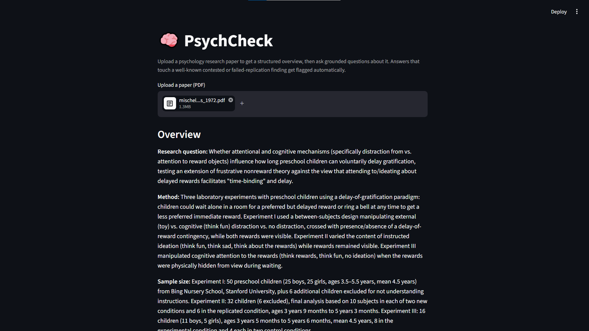
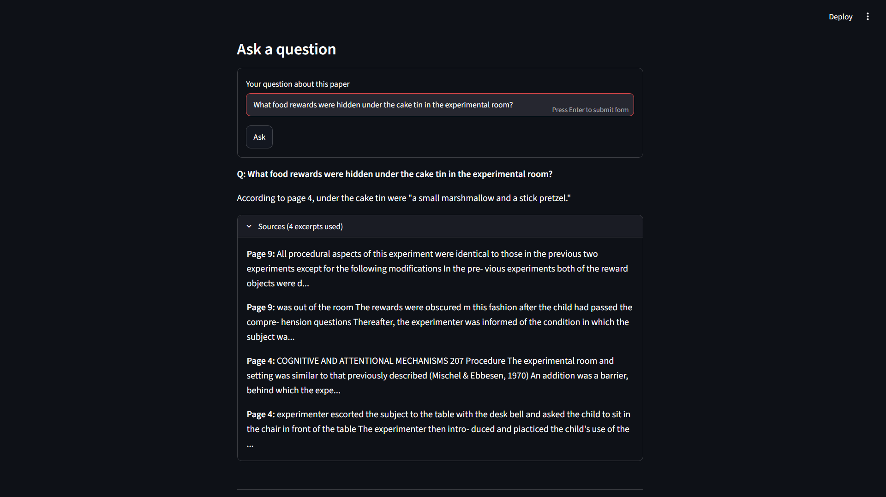
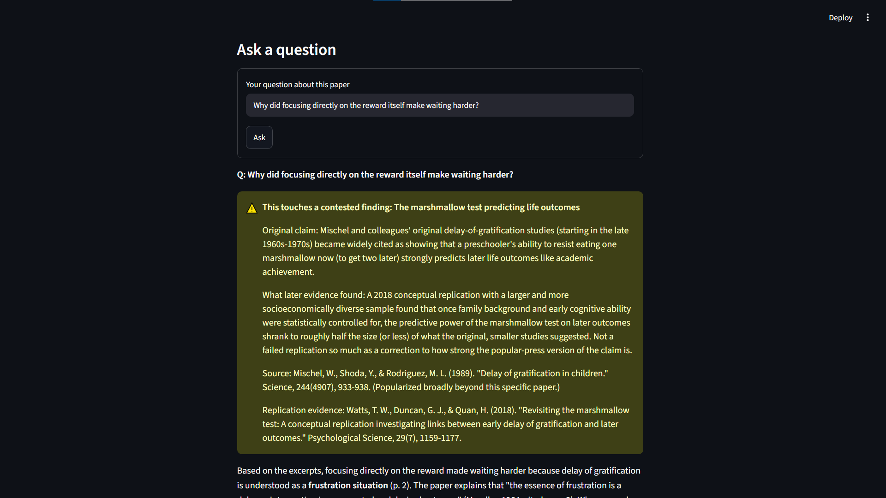

# PsychCheck

A hands-on project built to explore RAG (Retrieval-Augmented Generation) pipelines, text chunking, vector embeddings with ChromaDB, and evaluating model accuracy and limitations. Specifically geared toward psychology papers, because I've always had an interest in how our brains work and loved hearing about the changes in discoveries with replicated experiments (notably the Marshmallow Test by Walter Mischel, which is in this project's database!).

Thus PsychCheck was born, a RAG-powered research assistant for psychology papers. Papers are chunked and embedded into ChromaDB using LangChain, then retrieved and answered using Claude for grounded, source-cited responses so that every answer is traceable back to the original paper rather than generated from general knowledge, and automatically checked against a curated database of well-documented contested and failed-replication findings in psychology.

PsychCheck was evaluated against 20 test questions spanning 2 uploaded psychology papers, covering both straightforward factual lookups and questions touching well-known contested findings. It correctly answered 70% of factual questions (7/10) with accurate source grounding, and correctly flagged 4 out of 5 questions referencing a contested/failed-replication finding, with 1 false positive on a question that didn't touch any flagged topic.

To use PsychCheck, upload a psychology research paper (PDF) and get

1. A **structured overview**: research question, method, sample size, key finding, limitations.
2. **Grounded, cited Q&A**: ask questions about the paper; answers are generated only from
   retrieved chunks of the PDF, with page citations.
3. **Contested-finding flags**: if an answer touches a well-known finding that has failed to
   replicate or is scientifically disputed (e.g. power posing, ego depletion), the app flags it
   and shows the counter-evidence and source.

## Screenshots

**Structured overview right after upload:**



**Grounded Q&A, with page citations you can expand:**



**A contested-finding flag firing, with evidence and source:**



---

This is a **single-pass RAG** app: retrieve → generate → check against a small hand-curated list
of contested findings. There's no retry or self-correction loop — see [CLAUDE.md](CLAUDE.md) for
why that's a deliberate scope cut, not an oversight.

## Stack

- **LLM:** Claude (via `langchain-anthropic`)
- **Orchestration:** LangChain (`PyPDFLoader`, `RecursiveCharacterTextSplitter`, `Chroma`)
- **Embeddings:** `sentence-transformers/all-MiniLM-L6-v2`, run locally — free, no API calls
- **Vector store:** Chroma (local, in-memory per session)
- **UI:** Streamlit

## Setup

```bash
python -m venv .venv
.venv\Scripts\activate        # Windows
pip install -r requirements.txt
```

Copy `.env.example` to `.env` and add your Anthropic API key:

```bash
cp .env.example .env
```

Then edit `.env` and paste your key from https://console.anthropic.com/settings/keys.

## Run

```bash
streamlit run src/app.py
```

## Project layout

```
psychcheck/
├── data/
│   ├── contested_findings.json   # the hand-curated contested/failed-replication findings
│   └── uploads/                  # uploaded PDFs land here (gitignored)
├── eval/                         # eval question sets, fixtures, and the runner (see below)
├── screenshots/                  # images used in this README
└── src/
    ├── contested_findings.py     # loads + matches against contested_findings.json
    ├── pipeline.py                # PDF -> chunks -> vectorstore -> overview -> Q&A
    └── app.py                     # Streamlit UI
```

See [CLAUDE.md](CLAUDE.md) for the design decisions behind each piece (why this chunk size,
why Chroma, why keyword matching for flags instead of another LLM call, etc.) so the project
is easy to explain or rebuild from scratch later.
